# Fluxion Runtime 详细设计 V1.7

> **文档编号**: MOD-AGENT-RUNTIME-V1  
> **文档版本**: v1.7  
> **创建日期**: 2026-08-23  
> **文档状态**: 设计评审中  
> **上位架构基线**: `docs/architecture/fluxion-architecture-baseline-v1.md`

**评审边界说明**:
- **需求评审**: 第 2 章（需求分析）→ 通过后锁定为需求基线 v1.0
- **设计评审**: 第 3-4 章（技术设计 + 部署运维）→ 通过后锁定设计基线 v1.x
- **交接契约**: 2.5 验收条件 — 需求定义 What，设计实现 How

**ID 体系**: US（用户故事）、FEAT（功能）、API（接口）、RULE（业务规则/系统约束）、TC（测试用例）、RISK（风险）、NFR（非功能指标）  
场景编号：S-（正常）、E-（异常）、B-（边界）

**问题追溯约定**: `Pxx` 引用 `docs/problems/design-drivers.md` 的问题编号。任何新增核心设计必须至少映射一个 Pxx，避免为技术而设计。

---

## 目录

- [1. 文档控制](#1-文档控制)
- [2. 需求分析](#2-需求分析)
- [3. 技术设计](#3-技术设计)
- [4. 部署与运维](#4-部署与运维)
- [5. 风险与依赖](#5-风险与依赖)
- [6. 需求追溯矩阵](#6-需求追溯矩阵)
- [Spec Compliance Matrix](#spec-compliance-matrix)
- [附录：术语表](#附录术语表)

---

## 1. 文档控制

### 1.1 责任人

| 角色 | 姓名 | 职责范围 |
|------|------|---------|
| 产品经理 | 项目指定 | Runtime 使用需求、业务验收 |
| 开发负责人 | 项目指定 | Runtime 实现、接口与插件体系 |
| 测试负责人 | 项目指定 | 测试策略、回归与可靠性验证 |
| 架构师 | 项目指定 | Contract、边界、ADR 与架构一致性 |

### 1.2 修订历史

| 版本 | 日期 | 作者 | 变更描述 |
|------|------|------|---------|
| v0.1 | 2026-08-23 | 项目组 | 基于 Fluxion Architecture Baseline V1 生成初稿 |
| v1.0 | 需求评审通过日 | 项目组 | 需求评审通过 |
| v1.1 | 设计评审通过日 | 项目组 | 设计评审通过 |

---

## 2. 需求分析

### 2.1 需求概述 [必填]


> **核心领域语义**：本文中的 Agent 指实际运行的 Agent Runtime Service/Pod；Console 管理的配置对象统一称为 `RuntimeProfile`。所有 Runtime Pod 使用同一 Registry 解析同一个 RuntimeProfile 和 UserRuntimeState，不存在“一份 RuntimeProfile 对应一个 Pod”的关系。


| 项目 | 内容 |
|------|------|
| **模块名称** | Fluxion Runtime |
| **模块ID** | MOD-AGENT-RUNTIME |
| **所属系统/产品线** | Fluxion Harness |
| **需求类型** | 新功能 + 技术重构 |
| **业务背景** | 旧 `muad-openclaw` 在配置重启、Agent 强绑定 Skill/MCP、状态与 Pod 耦合、Dev/Prod 配置模型不一致、Core 持续膨胀等方面暴露结构性问题，需要重新实现 Stateless、Pluggable 的 Agent Runtime；Console 为配套配置入口（SQLite/PostgreSQL Registry），Kernel 仍可 SDK/CLI 独立调用。 |
| **核心目标** | 提供一个无状态横向扩展、资源动态解析、插件化和可热更新的 Python Agent Runtime；Kernel 可 SDK/CLI 独立调用，Console 为配套配置入口。 |

#### 2.1.1 直接设计依据

本模块重点解决 Design Drivers 中的问题：

`P01 P02 P03 P04 P05 P06 P07 P08 P09 P10 P11 P12 P14 P16 P17 P18 P19 P20 P22`

其中：
- P01/P07 驱动 Registry + Version + Snapshot；
- P02/P05 驱动 Stateless Runtime Pool；
- P03/P16/P17 驱动 user/resource-centric resolver；
- P04/P06 驱动 SQLite/PostgreSQL Store SPI 与 Console-first 开发配置（Kernel 可 SDK/CLI 独立调用）；
- P08/P09/P10 驱动 Microkernel + Plugin + Hook + Trust Boundary；
- P11/P12 驱动 Tool/Workflow/Capability 边界；
- P18/P19 驱动 Trace/Eval/Latency Budget；
- P20 驱动 A2A 最小协议；
- P22 约束所有设计必须可追溯到真实问题。

---

### 2.2 痛点与价值 [必填]

| 维度 | 内容 |
|------|------|
| **目标用户** | Agent Framework 开发者、平台开发者、企业内部 Agent 应用开发者、SRE/平台运维人员 |
| **当前问题** | 配置修改依赖重启；Agent/Skill/MCP 强绑定；Runtime 难以无状态扩容；本地与生产配置模式冲突；横切能力持续侵入 Core；执行版本不可稳定追溯 |
| **业务影响** | 配置发布影响在线用户；多 Agent/多 Pod 后配置一致性差；重复配置和凭证增加维护成本；平台扩展成本持续上升 |
| **预期价值** | 配置发布与 Runtime 生命周期解耦；Agent 无状态横向扩展；同一用户跨 Agent 共享一致资源；支持本地轻量开发与生产集中治理；通过插件体系降低核心变更频率 |

**用户故事**

| 编号 | 用户故事 | 优先级 |
|------|---------|--------|
| US-01 | 作为 Agent 开发者，我希望默认通过 Agent + Console + SQLite 启动本地完整开发环境，同时保留 SDK/CLI 直接调用 Runtime Kernel 的能力，以便兼顾产品体验与框架调试 | P0 |
| US-02 | 作为平台管理员，我希望配置发布后新请求自动使用最新版本且不重启 Pod，以便不中断在线服务 | P0 |
| US-03 | 作为平台开发者，我希望任意 Runtime Pod 都能执行同一个运行态配置，以便使用 K8s HPA 横向扩展 | P0 |
| US-04 | 作为用户，我希望多个 Agent 读取同一份属于我的 Skill/MCP/Credential Binding，以便保持一致体验 | P0 |
| US-05 | 作为框架开发者，我希望通过 Plugin 扩展 Model/Memory/Storage/Tool 等能力，以便避免修改 Core | P0 |
| US-06 | 作为安全平台开发者，我希望在 Tool/LLM/MCP 生命周期注入 Hook，以便实现鉴权、审计、审批和语义校验 | P0 |
| US-07 | 作为运维人员，我希望每次执行可追溯到精确资源版本，以便定位问题、回滚和 Eval | P0 |
| US-08 | 作为业务开发者，我希望 Agent 可以调用 Capability、Workflow 和其他 Agent，而不与具体实现强耦合 | P1 |

---

### 2.3 功能方案 [必填]

#### 2.3.1 功能清单

| 功能ID | 功能名称 | 功能描述 | 优先级 | 来源 |
|--------|---------|---------|--------|------|
| FEAT-01 | Local Product Bundle | 默认提供 Agent Runtime + Console + SQLite 一体化开发模式；同时保留 SDK/CLI 直接调用 Runtime Kernel | P0 | US-01 / P04/P06 |
| FEAT-02 | RuntimeProfile 解析 | 根据 `tenant_id + user_id + runtime_profile_id` 解析运行态配置 | P0 | US-03 / P02/P05 |
| FEAT-03 | Resource Resolver | 解析 Skill/MCP/Plugin/Policy/Binding 并计算 Effective Capability | P0 | US-04 / P03/P16/P17 |
| FEAT-04 | Execution Snapshot | 执行开始时冻结资源版本，保证单次执行一致性 | P0 | US-02/US-07 / P07 |
| FEAT-05 | Registry SPI | SQLiteStore、PostgreSQLStore、RemoteStore 统一 RegistryStore Contract | P0 | US-01/US-02 / P04 |
| FEAT-06 | Hot Reload | 配置变更事件触发 L1 Cache 失效，新请求加载最新版本 | P0 | US-02 / P01 |
| FEAT-07 | Microkernel | Kernel 仅保留 Context/Event/Lifecycle/Plugin/Execution Contract | P0 | US-05 / P08 |
| FEAT-08 | Plugin Runtime | 注册 AgentLoop、Model、Tool、Memory、Storage、Sandbox 等 Capability | P0 | US-05 / P08/P10 |
| FEAT-09 | Typed Hook/Event | 支持生命周期拦截、优先级、超时、fail policy、scope | P0 | US-06 / P09/P19 |
| FEAT-10 | Skill Runtime | 加载 Declarative Skill 与版本化 Skill Artifact | P0 | US-04 / P03 |
| FEAT-11 | MCP Runtime | 根据用户/租户 Binding 动态建立 MCP Client/Tool View | P0 | US-04 / P03/P16 |
| FEAT-12 | Tool Runtime | Tool Schema、调用、权限前置、结果校验、Trace | P0 | US-06/US-08 / P12/P14/P16 |
| FEAT-13 | Workflow Tool Adapter | 将 Workflow 作为粗粒度 Tool 调用，不承载 Workflow durable state | P1 | US-08 / P11 |
| FEAT-14 | A2A Adapter | 最小 A2A request/response/trace/auth contract | P1 | US-08 / P20 |
| FEAT-15 | Session/Memory SPI | Runtime 不持久化事实状态，通过外部 Store 接口访问（默认多层实现见 FEAT-22） | P0 | US-03 / P02/P17 |
| FEAT-16 | Trace & Usage | 记录 ExecutionSnapshot、模型、Tool/MCP/Hook、延迟、Token、错误 | P0 | US-07 / P18/P19 |
| FEAT-17 | Runtime Policy | shared/dedicated/sandbox/gpu/remote 等运行策略接口（sandbox 策略执行后端由 FEAT-21 提供） | P1 | US-03 / P05/P10 |
| FEAT-18 | Error Model | 统一可恢复/不可恢复/策略拒绝/依赖超时等错误分类 | P0 | US-07 |
| FEAT-19 | Model Provider 插件 | Model Provider 插件 Contract（stream/non-stream、tool calling、timeout/failover）+ 默认实现（OpenAI-compatible HTTP）；AgentLoop 经其完成推理 | P0 | US-01 / P08/P19 |
| FEAT-20 | 内置基础工具 | V1 内置业务无关基础工具集：`time`、`calc`、`http.get`（P0，零外部依赖）与 `search_files`/`read_file`/`list_dir`/`write_file`/`run_command`（P1，`run_command`/`code.exec` 必须经 Sandbox Backend，`file.*` 受路径 allowlist 与审批约束），作为第一方工具注册，走统一 Tool 调用链与权限/Trace | P0 | US-06/US-08 / P12/P14 |
| FEAT-21 | Sandbox Backend | 隔离执行后端：SandboxBackend SPI（prepare/run/cleanup、timeout/资源限制/网络策略/只读根文件系统）+ 平台键控后端注册（Linux 走 bwrap，真实 namespace/seccomp 隔离；macOS 走原生 sandbox-exec（Seatbelt profile），真实隔离文件系统与网络；dev 降级实现显式标注非生产；Windows AppContainer+Job Objects 标 P2 按需），无可用后端时 fail-closed；`run_command`/`code.exec` 与 ADR-010 不可信扩展统一经其执行 | P1 | US-05 / P10 |
| FEAT-22 | Memory 默认实现（多层） | 多层 Memory 默认实现：L0 工作记忆（单次执行，RuntimeContext 瞬时）/ L1 会话记忆（单会话，SessionMemoryStore）/ L2 长期记忆（跨会话·tenant 作用域，外部 Store + 可选向量索引）；临近上下文上限触发自动落盘（MemoryFlush；上下文压缩见 FEAT-23）；向量索引为可选后端、默认不启用（P06 零外部依赖）；复用 FEAT-15 SPI，受 `memory_policy` 控制 | P1 | US-05 / P02/P17 |
| FEAT-23 | 上下文压缩（Context Compaction） | 临近上下文上限时对旧轮次做摘要压缩（区别于 FEAT-22 持久化落盘）：保留最新 N 轮原文 + 旧轮次摘要；压缩后的摘要落入 L1/L2 Memory，原文按 memory_policy 保留或弃；压缩策略复用 FEAT-19 Model Provider | P2 | US-03 / P17 |
| FEAT-24 | 定时/主动任务（Cron/Heartbeat） | 统一调度器按时间触发 AgentLoop，每次触发构造独立 Execution（无跨执行持久状态）；调度配置作为 Resource 管理（版本化、可审计），受 RuntimePolicy/Approval 约束 | P2 | US-03 / P02 |
| FEAT-25 | 规划（Plan-then-execute） | AgentLoop 增强：对长任务先产出步骤序列（plan），逐步执行、失败触发重规划（re-plan）；规划状态只存在于当前 Execution（Runtime 不持久化规划事实状态）；规划与执行全程记录 Trace | P2 | US-01 / P08 |

#### 2.3.2 核心资源字段约束

**RuntimeProfile**

| 字段名 | 字段类型 | 必填 | 约束 | 说明 |
|--------|---------|------|------|------|
| id | string | Y | 同一 scope 内唯一 | 运行态配置 ID |
| version | string/int | Y | 不可变版本 | Published 后不可原地修改 |
| prompt | object/ref | Y | 可引用外部 Prompt Resource | 不含 Secret |
| model_policy | object | Y | Provider/Model/route policy | 不直接保存 Provider Secret |
| allowed_skills | list | N | Resource ID/selector | Allowlist |
| allowed_mcps | list | N | Resource ID/selector | Allowlist |
| allowed_tools | list | N | Tool selector | Allowlist |
| allowed_workflows | list | N | Workflow selector | 粗粒度能力 |
| plugin_bindings | list | N | PluginBinding ref | Runtime 扩展 |
| guardrail_policy | ref | N | Policy resource | |
| memory_policy | ref/object | N | 不持久化真实 Memory | |
| runtime_policy | ref/object | N | shared 为默认建议 | |
| status | enum | Y | draft/published/deprecated | Runtime 默认只解析 published |

**ExecutionSnapshot**

| 字段名 | 类型 | 必填 | 约束 | 说明 |
|--------|------|------|------|------|
| execution_id | string | Y | 全局唯一 | |
| tenant_id | string | Y | 不可空 | 多租户上下文 |
| user_id | string | Y | 不可空 | 资源归属解析 |
| runtime_profile_id | string | Y | 不可空 | |
| runtime_profile_version | string | Y | 固定 | 单次执行不变 |
| skill_versions | map | N | 固定 | |
| mcp_versions | map | N | 固定 | |
| plugin_versions | map | N | 固定 | |
| policy_version | string | N | 固定 | |
| model_resolution | object | Y | 固定解析结果 | |
| trace_id | string | Y | 全链路 | |

---

### 2.4 范围与边界 [必填]

> **数据边界**：本项目为全新开发，不包含任何旧系统数据迁移、双写、历史数据导入或兼容读取需求。旧项目仅作为问题来源和行为参考。


| 类别 | 内容 |
|------|------|
| **范围（In Scope）** | Python Agent Runtime、与 Console 的同仓配套发布契约、SDK/CLI/API、Resource Resolver、Registry SPI、ExecutionSnapshot、Plugin/Hook、Model Provider 插件（含默认实现）、Skill/MCP Runtime、Tool Runtime、内置基础工具（time/calc/http.get/search_files/file/run_command）、Sandbox Backend（隔离执行，平台键控后端 + fail-closed）、Workflow Tool Adapter（接入协议，Engine 归业务接入层）、Session/Memory SPI 与 Memory 默认实现（多层 L0/L1/L2）、上下文压缩、AgentLoop 规划、定时/主动任务（Cron/Heartbeat，P2）、Trace、热加载 |
| **非范围（Out of Scope）** | Console 页面；企业组织架构；具体 HR/CRM/ERP 业务逻辑；Workflow Engine/DSL 执行与业务 WorkflowDefinition（整体归业务接入层，不在开源 V1 范围）；企业 Secret Store 产品实现；完整复杂 A2A 标准实现 |
| **前置假设** | Fluxion Architecture Baseline V1 作为 Architecture Baseline；所有生产请求具备 tenant/user/agent 上下文；业务能力通过稳定 Capability/MCP/HTTP Contract 暴露 |
| **有意妥协 / 技术债** | V1 优先实现最小可用 Microkernel 与 Plugin Contract；A2A 仅最小协议；Dedicated Runtime 先定义策略 Contract，可延后实现 Controller；Workflow Tool Adapter 接入协议在 V1 实现（FEAT-13/S-R08，Engine 以 Stub 验证），Workflow Engine/durable state 与 Capability Center 归业务接入层、开源 V1 不开发；性能目标先按本文 NFR 基线实现，压测只能用于验证和后续调优，不能作为开发阶段不设目标的理由；Sandbox Backend 生产以 Linux bwrap（namespace/seccomp）与 macOS sandbox-exec（Seatbelt profile）实现；dev 降级实现显式标注非生产、不伪装隔离边界；Windows 原生后端（AppContainer+Job Objects）标 P2 按需，V1 仅保证跨平台 fail-closed（无原生后端平台拒绝 run_command/code.exec） |

---

### 2.5 验收条件 [必填]

#### 2.5.1 业务规则与约束

| ID | 类型 | 描述 | 验证场景 |
|----|------|------|---------|
| RULE-01 | 系统约束 | Runtime Kernel 不依赖 Console 才能被 SDK/CLI 调用；但 Fluxion 产品的默认 dev 发行形态必须包含 Console + Agent + SQLite | S-R01 |
| RULE-02 | 系统约束 | Published 配置变更不得要求重启 Runtime Pod | S-R02 |
| RULE-03 | 系统约束 | 单次 Execution 内资源版本必须固定 | S-R03 |
| RULE-04 | 安全规则 | Effective Capability 必须满足 User Grant ∩ Agent Allowlist ∩ Tenant Policy | S-R04/E-R03 |
| RULE-05 | 系统约束 | Credential 不得写入 RuntimeProfile/SkillDefinition/MCPDefinition 明文字段 | E-R04 |
| RULE-06 | 系统约束 | Runtime Pod 删除后不得丢失事实配置和持久状态 | S-R05 |
| RULE-07 | 安全规则 | Untrusted Plugin 不允许默认 in-process 执行 | E-R05 |
| RULE-08 | 系统约束 | Hook 必须具备 timeout 与 fail policy | S-R06/E-R06 |
| RULE-09 | 系统约束 | Runtime 只依赖 RegistryStore Contract，不依赖具体 Store | S-R07 |
| RULE-10 | 系统约束 | Workflow durable state 不得保存在 Agent Runtime | S-R08 |
| RULE-11 | 可追溯 | Trace 必须关联 ExecutionSnapshot 和实际调用版本 | S-R09 |
| RULE-12 | 多租户 | Cache、Session、Binding 解析均必须包含 tenant scope | E-R07 |
| RULE-13 | 存储一致性 | SQLite 与 PostgreSQL 必须通过同一 RegistryStore Contract Test；Runtime 不直接依赖数据库方言 | S-R10 |
| RULE-14 | A2A | V1 最小 A2A Adapter 必须具备 request/response/trace/auth contract | S-R11 |
| RULE-15 | Secret | Dev 必须提供 LocalEncryptedSecretStore（AES-256-GCM）；生产通过 SecretStore SPI 接企业 Secret Provider | E-R09 |
| RULE-16 | 分阶段验收 | TASK-005 不允许依赖尚未实现的 Console/Web UI；CLI Golden Path 由 S-R12 验收，完整产品 Golden Path 延后至 S-R01 | S-R01/S-R12 |
| RULE-17 | 系统约束 | AgentLoop 必须通过 Model Provider 插件完成推理调用；V1 提供至少一个默认实现（OpenAI-compatible HTTP），支持 stream/tool calling/timeout/failover | S-R13 |
| RULE-18 | 系统约束 | Tool 调用结果必须统一为 Tool Result Contract：`completed(result)` / `started(run_id,status)` / `streamed(events)` 三形态；Workflow 走 `started` 异步，AgentLoop 不区分执行体类型 | S-R14 |
| RULE-19 | 系统约束 | V1 内置基础工具必须业务无关：`time`/`calc`/`http.get`（time/calc 零外部依赖）；`file.*`（read/write/list/search）受路径 allowlist 约束、默认只读、写操作走高危审批；`run_command` 必须经 Sandbox Backend，禁止脱离沙箱直接执行命令 | S-R15/S-R16 |
| RULE-20 | 系统约束 | 沙箱执行必须 fail-closed：无可用 Sandbox Backend（含当前平台无原生后端）时 `run_command`/`code.exec` 拒绝；沙箱默认无网络、只读根文件系统、CPU/内存/超时上限；越权访问（越出工作目录/超时）直接终止并记录 Trace | S-R16 |
| RULE-21 | 系统约束 | Memory 默认实现必须多层：L0 工作记忆随执行结束即弃、L1 会话记忆按会话隔离、L2 长期记忆按 tenant 作用域且经外部 Store（Runtime 不持久化事实状态）；临近上下文上限触发自动落盘；向量索引为可选后端、默认不启用（P06 零外部依赖） | S-R17 |
| RULE-22 | 系统约束 | 上下文压缩必须与持久化落盘分离：临近上限时保留最新 N 轮原文、旧轮次压缩为摘要；压缩后的摘要落入 L1/L2 Memory，原文按 memory_policy 保留或弃；压缩只作用于对话上下文，不得改变 ExecutionSnapshot | S-R18 |
| RULE-23 | 系统约束 | 定时/主动任务必须经统一调度器触发 AgentLoop，每次触发构造独立 Execution（Runtime 不保存跨执行持久状态）；调度配置作为 Resource 管理（版本化、可审计），触发与执行受 RuntimePolicy/Approval 约束 | S-R19 |
| RULE-24 | 系统约束 | AgentLoop 规划必须可暂停/可重规划：规划产出步骤序列逐步执行，失败可触发重规划；规划状态仅存在于当前 Execution；规划与执行均记录 Trace | S-R20 |

#### 2.5.2 功能验收场景

**正常场景**

| 场景ID | 功能ID | 优先级 | 测试层级 | 关键真实边界 | 前置条件 | 操作步骤 | 预期结果 |
|--------|--------|--------|---------|-------------|---------|---------|---------|
| S-R01 | FEAT-01 | P0 | E2E | Console + SQLite Registry + Runtime + Web Chat | 本地新安装环境，Console/Chat 已实现 | 启动默认 dev bundle，在 Console 创建并发布 RuntimeProfile，从 Web Chat 完成绑定后执行一次请求 | 无需外部数据库即可完成配置、绑定与对话；该 Golden Path 在 Console/Chat 就绪后的 TASK-103 验收，Runtime Kernel 独立能力由 S-R12 在 TASK-005 验收 |
| S-R02 | FEAT-05/06 | P0 | E2E | CLI/ApplicationService → Registry → Event → Runtime Cache → 新执行 | Runtime 已运行，RuntimeProfile v1 已发布 | 在 TASK-005 阶段通过 CLI/ApplicationService 发布 v2，不重启 Pod，再发起新请求 | 新请求使用 v2，旧执行不受影响；Console 发布链路另由 S-C102 验收 |
| S-R03 | FEAT-04 | P0 | E2E | Resolver → Snapshot → Runtime → Trace | 执行中间发布 Skill 新版本 | 开始执行后发布 Skill v2 | 当前执行全程使用 v1，新执行使用 v2 |
| S-R04 | FEAT-03/11/12 | P0 | E2E | User Binding → Policy → MCP Tool | 用户有 MCP，Agent 仅允许部分 Tool | 调用允许 Tool | 只暴露并成功调用交集内 Tool |
| S-R05 | FEAT-02/15 | P0 | E2E | Registry/Session Store → 两个 Runtime 实例 | 两个 Runtime Pod 可访问同一 Store | Pod1 执行后删除，Pod2 接续新请求 | 运行态配置/用户资源不丢失 |
| S-R06 | FEAT-09 | P0 | integration | Event Bus → 两个 Hook | 注册不同 priority Hook | 触发 before_tool_call | 按 priority 执行并记录结果 |
| S-R07 | FEAT-05 | P0 | integration | Runtime → SQLiteStore/PostgreSQLStore 两实现 | 同一 Fixture | 分别运行同一解析测试 | Contract 行为一致 |
| S-R08 | FEAT-13 | P1 | E2E | Agent → Workflow Adapter → Workflow Stub | Workflow 已发布 | Agent 选择并启动 Workflow | Agent 获得 workflow_run_id，不保存内部 durable state |
| S-R09 | FEAT-16 | P0 | E2E | Runtime → Trace Store | 一次含 LLM+Tool 的执行 | 完成执行 | Trace 包含 snapshot/model/tool/hook/latency/error 信息 |
| S-R10 | FEAT-05 | P0 | integration | SQLite + PostgreSQL | 两数据库执行相同 migration/fixture | 运行同一 RegistryStore Contract Test | CRUD、版本选择、Binding、并发冲突的语义一致 |
| S-R11 | FEAT-14 | P1 | integration | Runtime → A2A Adapter → Stub Peer | 已配置最小 A2A peer/auth | 发起 request 并接收 response | request/response/trace/auth contract 可互操作，错误映射稳定 |
| S-R12 | FEAT-01 | P0 | E2E | CLI → ApplicationService → SQLite Registry → Runtime | Console/Web UI 尚未作为本 TASK 前置依赖 | 使用 `fluxion` CLI 创建/发布 RuntimeProfile 并经 Model Provider 插件执行请求 | TASK-005 可独立 GREEN，不依赖未来 Console/Chat；与最终 S-R01 Golden Path 使用同一 ApplicationService |
| S-R13 | FEAT-19 | P0 | E2E | AgentLoop → Model Provider 插件 → LLM（Stub/真实 Provider） | 已配置 model 插件且 RuntimeProfile 引用之 | Agent 发起一次含 Tool Calling 的对话 | 经 Model Provider 完成推理并返回可解析的 tool call/响应；超时/失败按 agent policy failover |
| S-R14 | FEAT-12/13/20 | P0 | E2E | Tool Runtime → Capability 执行体（同步工具 / Workflow Adapter / 流式 MCP） | 已配置同步工具、Workflow Adapter（Stub）与流式 MCP 工具 | Agent 分别触发三种执行形态 | 统一 Tool Result Contract 信封返回 `completed(result)` / `started(run_id,status)` / `streamed(events)`；三类调用记录同一 policy_decision_id 与 Trace |
| S-R15 | FEAT-20 | P0 | E2E | Agent → Tool Runtime → 内置基础工具（`time`/`calc`/`http.get`/`search_files`/`read_file`） | 默认 dev bundle 已注册内置基础工具 | Agent 调用零依赖工具与 `search_files`/`read_file` | 零外部依赖工具直接可用；`file.*` 越出 allowlist 路径被拒、默认只读 |
| S-R16 | FEAT-21 | P1 | E2E | Agent → Tool Runtime → `run_command`/`code.exec` → SandboxBackend（Linux bwrap / macOS sandbox-exec / dev 降级 / 无原生后端平台） | 已启用 Sandbox Backend | Agent 经沙箱执行命令/代码 | 默认无网络、只读根、超时 kill；越权访问被拒；平台矩阵：Linux 解析到 bwrap、Darwin 解析到 sandbox-exec，无原生后端平台 fail-closed 拒绝并记录 Trace |
| S-R17 | FEAT-22 | P1 | E2E | AgentLoop → Memory SPI → L0/L1/L2 多层读写与触发落盘 | 已注册 Memory 默认实现 | Agent 会话内写入记忆并跨会话读取 | L0 随执行结束即弃；L1 会话内可读、会话外不可见；L2 跨会话可读且 tenant 隔离；临近上下文上限自动落盘 |
| S-R18 | FEAT-23 | P2 | E2E | AgentLoop → Context Compactor（临近上限摘要）→ L1/L2 落盘 | 长会话接近上下文上限 | 继续对话触发压缩 | 最新 N 轮保留原文、旧轮次被摘要；摘要落入 L1/L2；后续对话不丢关键上下文；ExecutionSnapshot 不变 |
| S-R19 | FEAT-24 | P2 | E2E | Scheduler → 到点触发 → AgentLoop（独立 Execution） | 已发布定时/主动任务 Resource | 到达触发时刻 | 生成独立 Execution 并完成；调度配置走统一调用链（Policy/Hook/Trace）；Runtime 无跨执行持久状态 |
| S-R20 | FEAT-25 | P2 | E2E | AgentLoop → plan-then-execute（分解/执行/失败重规划） | 长任务 | Agent 规划并执行多步任务 | 规划产出步骤序列逐步执行；失败触发重规划；规划状态仅限当前 Execution；全程 Trace |

**异常场景**

| 场景ID | 功能ID | 测试层级 | 关键真实边界 | 触发条件 | 系统行为 | 用户感知 |
|--------|--------|---------|-------------|---------|---------|---------|
| E-R01 | FEAT-05 | integration | Runtime → Registry | Registry 暂时不可用且 L1 有有效缓存 | 发起请求 | 在策略允许范围内使用缓存；记录 degraded 状态 | 可继续或返回明确依赖错误，取决于资源安全等级 |
| E-R02 | FEAT-04 | integration | Resolver → Snapshot | 引用版本不存在/已撤销 | 创建 Snapshot | 拒绝执行，不自动静默换版本 | 返回可识别资源版本错误 |
| E-R03 | FEAT-03/12 | E2E | Policy → Tool Runtime | User 有授权但 Agent 不在 Allowlist | 请求 Tool | 拒绝调用并记录 policy decision | 明确无权限 |
| E-R04 | FEAT-02/10/11 | unit | Schema Validator | Definition 包含明文 credential 字段 | 加载资源 | 校验失败 | 配置错误 |
| E-R05 | FEAT-08 | integration | Plugin Loader → Trust Policy | untrusted plugin 请求 in-process | 加载 Plugin | 拒绝或重定向隔离模式 | Plugin 不可用并给出原因 |
| E-R06 | FEAT-09 | integration | Hook → Timeout/Fail policy | fail_closed Hook 超时 | 执行 Tool | 阻止后续 Tool 调用 | 返回策略/安全错误 |
| E-R07 | FEAT-03/15 | integration | Tenant A/B Store + Cache | 伪造跨 tenant resource id | 解析资源 | 不得命中其他 tenant 数据 | 返回 not found/forbidden |
| E-R08 | FEAT-11 | E2E | MCP Client → Credential Resolver | Credential revoked | 调用 MCP | 不复用旧 Credential Client；拒绝调用 | 认证失效提示 |
| E-R09 | FEAT-11/12 | integration | LocalEncryptedSecretStore → Credential Resolver | 本地 Secret 使用 AES-256-GCM 密文存储，Master Key 缺失/错误 | 读取 CredentialRef | 明文不落 Registry/日志；Master Key 异常时 fail closed | 返回明确 Secret Provider 错误 |

**边界场景**

| 场景ID | 测试层级 | 关键真实边界 | 字段/条件 | 边界值 | 预期行为 |
|--------|---------|-------------|----------|--------|---------|
| B-R01 | integration | Resolver/Cache | config changed event 丢失 | TTL 到期 | 最终重新读取 Registry 获取最新版本 |
| B-R02 | unit | Hook Scheduler | 多 Hook priority 相同 | 相同 priority | 使用稳定次序规则，结果可重复 |
| B-R03 | E2E | Runtime Pool | 并发请求落多个 Pod | 并发基线 200 RPS/Pod 起测，最终按实际模型/Tool 工作负载分层评估 | 同一版本解析一致，无 Pod 本地事实差异 |
| B-R04 | benchmark | Resource Resolver | L1 cache hit | P95 ≤ 5ms | benchmark verifier 达标，否则任务不得完成 |
| B-R05 | benchmark | Hook Framework | 仅框架调度，不含 Hook 外部 I/O | P95 ≤ 10ms | benchmark verifier 达标，否则任务不得完成 |
| B-R06 | benchmark | Runtime Framework | 不含模型/外部 Tool | P95 ≤ 50ms，P99 ≤ 100ms | benchmark/load verifier 达标，否则任务不得完成 |
| B-R07 | benchmark | ExecutionSnapshot Builder | 典型 RuntimeProfile + UserRuntimeState + Policy | P95 ≤ 20ms | benchmark verifier 达标，否则任务不得完成 |

#### 2.5.3 非功能指标 [按需]

**性能指标**

| 指标ID | 指标名称 | 目标值 | 测量方法 |
|--------|---------|-------|---------|
| NFR-PERF-01 | Resource Resolver L1 命中开销 P95 | ≤ 5ms | Benchmark/APM |
| NFR-PERF-02 | Snapshot 构建 P95 | ≤ 20ms | Benchmark/APM |
| NFR-PERF-03 | Hook Framework 额外开销 P95 | ≤ 10ms（不含 Hook 自身外部 I/O） | Benchmark |
| NFR-PERF-04 | Runtime 端到端额外框架开销（不含模型/外部 Tool） | P95 ≤ 50ms，P99 ≤ 100ms | 压测 |

**可靠性指标**

| 指标ID | 指标名称 | 目标值 |
|--------|---------|-------|
| NFR-REL-01 | Runtime 服务可用性 | ≥ 99.95% |
| NFR-REL-02 | 配置发布期间请求中断数 | 0 |
| NFR-REL-03 | 单次 Execution 配置漂移 | 0 |

**安全性要求**

| 指标ID | 安全域 | 验收标准 |
|--------|--------|---------|
| NFR-SEC-01 | 多租户隔离 | tenant A 不可读取/调用 tenant B Resource/Binding |
| NFR-SEC-02 | Secret | Definition/Trace/日志不得出现 Secret 明文 |
| NFR-SEC-03 | Plugin | untrusted extension 默认不能 in-process |
| NFR-SEC-04 | Tool/MCP | 所有调用必须通过 Effective Capability/Policy 判定 |


**DFX 非功能约束**

| 指标ID | 指标名称 | 目标值 |
|--------|---------|-------|
| NFR-DFX-01 | Runtime Pod 无状态符合率 | 100%，禁止事实状态只存在 Pod 本地 |
| NFR-DFX-02 | 核心 Store Contract 双库通过率 | SQLite/PostgreSQL 均 100% 通过 |
| NFR-DFX-03 | Published Resource 可追溯率 | 100% 关联 version + actor + trace/snapshot |
| NFR-DFX-04 | 外部依赖 timeout 配置覆盖率 | 100% |
| NFR-DFX-05 | Plugin/Hook trust/fail policy 配置覆盖率 | 100% |
| NFR-DFX-06 | 核心 API/执行错误可分类率 | 100% 使用统一 Error Model |
| NFR-DFX-07 | P0/P1 验收场景自动化率 | ≥ 95%；其余需明确 manual 原因 |
| NFR-DFX-08 | 关键路径 Trace 覆盖率 | 100% |

---

## 3. 技术设计

### 3.1 方案选型 [必填]

#### 3.1.1 核心方案对比

| 对比维度 | 权重 | 方案A：传统 Agent Core + Manager | 得分 | 方案B：Microkernel + Plugin Runtime | 得分 |
|---------|------|-------|------|-------|------|
| 核心复杂度可控 | 30% | 能力持续进入 Core | 2/5 | 稳定 Contract + Plugin | 5/5 |
| 可替换性 | 20% | 较低 | 2/5 | AgentLoop/Model/Storage 可替换 | 5/5 |
| 企业隔离能力 | 20% | 需额外补丁 | 2/5 | 可结合 trust/isolation policy | 4/5 |
| 实现复杂度 | 15% | 较低 | 4/5 | 初始较高 | 3/5 |
| 长期维护成本 | 15% | 高 | 2/5 | 较低 | 4/5 |
| **最终得分** | **100%** | | **2.3/5** | | **4.4/5** |

#### 3.1.2 Registry 方案

| 对比项 | 单一本地文件 | 强制数据库 | Store SPI |
|---|---|---|---|
| Local Dev | 最优 | 差 | 最优 |
| Production | 差 | 好 | 好 |
| 可测试性 | 中 | 中 | 高 |
| 可替换性 | 低 | 低 | 高 |
| 选择 | 否 | 否 | **是** |

#### 关键决策记录

| 决策点 | 选择 | 被否决项 | 理由 | 可逆性 |
|--------|------|---------|------|--------|
| Runtime 状态模型 | Stateless | Pod 内持久状态 | 支持 HPA、故障替换、一致性 | 难回退 |
| Agent 与 Pod | 解耦 | 一 Agent 一 Pod | 避免逻辑资源与基础设施绑定 | 难回退 |
| Core 架构 | Microkernel | 巨型 Core | 控制复杂度增长 | 中 |
| Hook | Typed Event + Interception | 各模块自行 Callback | 统一生命周期与治理 | 中 |
| Store | SPI | 固定 PostgreSQL | 同时支持 Dev/Prod | 易 |
| 热更新 | Version + Event + Snapshot | 原地对象变更 | 保证一致性和可追溯 | 难 |
| Skill/MCP ownership | User/Tenant Binding | Agent ownership | 同一用户跨 Agent 一致 | 难 |
| Plugin trust | 分级隔离 | 全部 in-process | 企业安全 | 中 |

#### 技术栈

| 类别 | 选型 | 版本 | 选型理由 |
|------|------|------|---------|
| 语言 | Python | 3.12+（建议，最终V1 固定） | 生态适合 Agent/LLM/Plugin；与项目定位一致 |
| Web API | FastAPI / ASGI | FastAPI 0.116+ / ASGI | Async、类型化、生态成熟；具体 patch 版本锁入 lockfile |
| 数据模型 | Pydantic | 2.11+ | Schema/Validation/序列化 |
| CLI | Typer | 0.16+ | 纯 CLI（无 GUI）；基于类型定义减少 CLI/API Schema 漂移 |
| 本地数据库 | SQLite | 3.x | 默认 Local Registry；单文件、零外部服务、事务/表结构与生产模型接近 |
| 生产数据库 | PostgreSQL | 16+ | 多实例共享、并发写、HA、审计与生产治理 |
| DB Access Layer | SQLAlchemy | 2.0+ | 通过统一 Repository/Store Contract 隔离 SQLite/PG 差异 |
| Cache/Event | Redis 7+（可选） | 7+ | L2/Event，不作为 Core 强依赖 |
| Trace | OpenTelemetry | 1.37+ | 标准链路追踪 |
| Package Plugin | Python entry points + Fluxion manifest | Python packaging standard | 安装发现与显式 Capability 注册 |

---

### 3.2 架构设计 [必填]

> **Mermaid 兼容性约束**：本文所有 Mermaid 图仅使用 `graph TD` / `graph LR`、基础节点和 `-->` 连线，不使用 `flowchart`、`stateDiagram`、`erDiagram`、虚线、复杂边标签或特殊字符，以兼容较老的 Mermaid Renderer。


#### 3.2.1 Runtime 总体架构

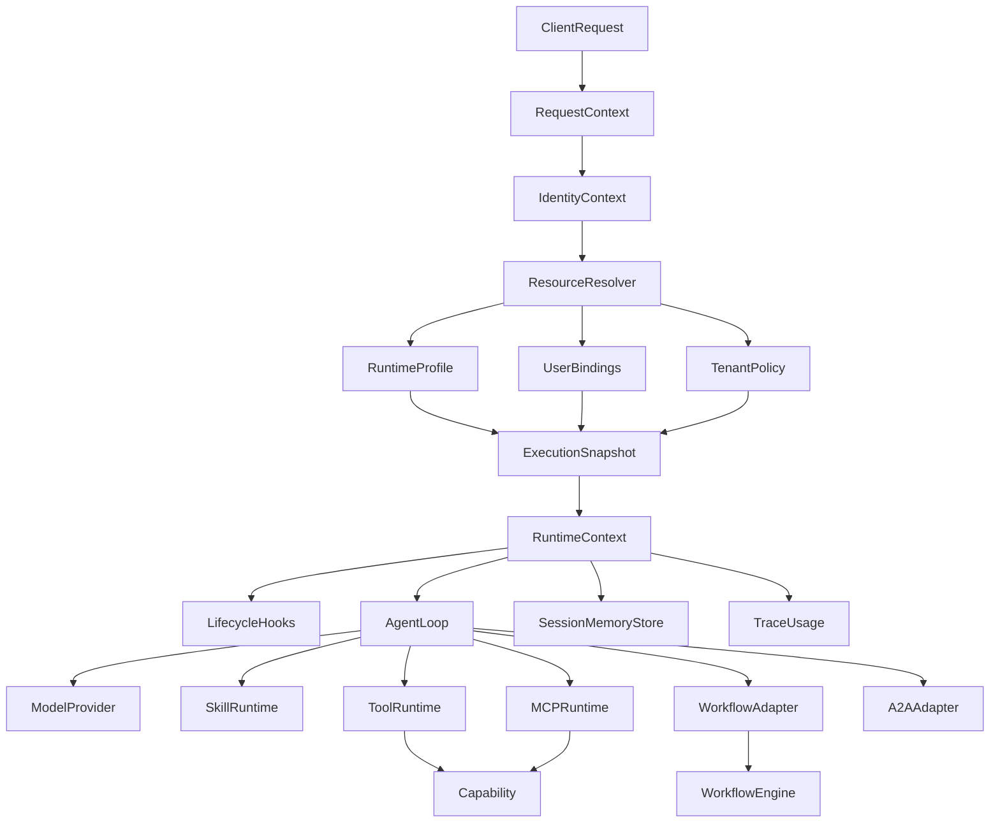

**读图说明：**

1. 请求进入 Runtime 后首先形成 `RequestContext`，其中必须包含可信的 `tenant_id`、`user_id`、`runtime_profile_id`、`session_id` 等上下文。
2. `ResourceResolver` 不只读取 RuntimeProfile，还会同时解析用户 Binding 与租户 Policy；三者共同决定一次执行真正可见的 Skill、MCP、Tool、Plugin 和 Workflow。
3. 解析结果被固化成 `ExecutionSnapshot`。从这一节点开始，本次 Execution 不再跟随配置热更新变化。
4. `RuntimeContext` 是一次执行的临时上下文，不是持久状态；它把 Snapshot、Hook、Session/Memory Adapter、Trace 等装配给 AgentLoop。
5. AgentLoop 只负责推理和能力选择。Tool/MCP 最终调用业务 `Capability`；Workflow 通过 Adapter 进入独立 Workflow Engine。
6. Session、Memory、Trace 均通过外部 Store/Provider 持久化，Runtime Pod 自身不拥有事实状态。


#### 3.2.2 技术分层

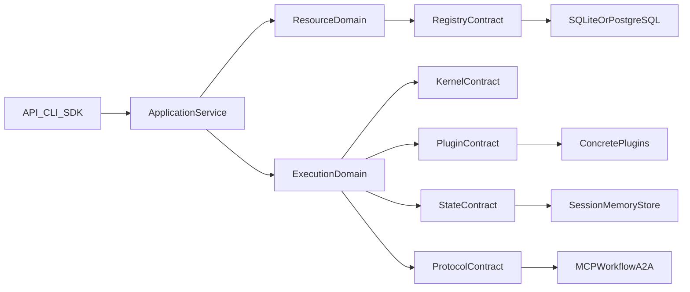

**分层边界：**

- `API/CLI/SDK` 只负责协议转换，不能直接访问数据库或具体 Provider。
- `ApplicationService` 负责用例编排，例如“执行一次 Agent”“解析一次 Snapshot”。
- `ResourceDomain` 和 `ExecutionDomain` 持有核心领域规则，是最稳定的业务内核。
- 数据库、Plugin、Session/Memory、MCP/Workflow/A2A 都位于 Contract 外侧，可以替换。
- 依赖方向必须始终从上层指向 Contract；Kernel 不能反向 import 具体 Plugin。


#### 3.2.3 推荐 Python 包结构

```text
fluxion/
├── kernel/
│   ├── context.py
│   ├── lifecycle.py
│   ├── events.py
│   ├── contracts.py
│   ├── execution.py
│   └── plugin.py
├── resources/
│   ├── models.py
│   ├── resolver.py
│   ├── snapshot.py
│   ├── policy.py
│   └── version.py
├── registry/
│   ├── base.py
│   ├── sqlite.py
│   ├── postgresql.py
│   ├── remote.py
│   └── cache.py
├── plugins/
│   ├── agent_loop/
│   ├── model/
│   ├── tool/
│   ├── skill/
│   ├── mcp/
│   ├── memory/
│   ├── storage/
│   ├── sandbox/
│   ├── guardrail/
│   └── observability/
├── runtime/
│   ├── app.py
│   ├── executor.py
│   ├── session.py
│   └── errors.py
├── protocols/
│   ├── mcp/
│   ├── a2a/
│   └── workflow/
├── api/
├── cli/
└── sdk/
```

#### 3.2.4 Resource Resolve 流程

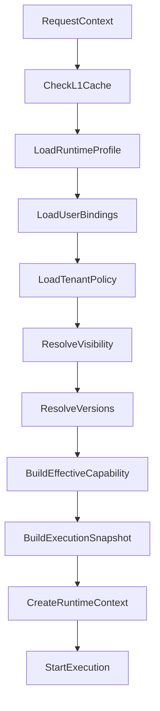

**关键语义：**

- L1 Cache 只能缓存 Resource/Binding/Policy 的不可变版本或可验证结果，Cache Key 必须包含 tenant scope。
- Visibility 先过滤 `system/public/tenant/private`，之后再计算 User Grant、Agent Allowlist、Tenant Policy 的交集。
- `latest-published` 只在 Snapshot 创建阶段解析一次，解析完成后转换成精确版本。
- 任一必需 Resource 版本不存在、被撤销或权限不满足时，Snapshot 构建必须失败，不能静默换成其他版本。


#### 3.2.5 Monorepo 与配套发布边界

Agent Runtime 与 Console 使用 **同一代码仓库统一看护、统一版本、统一 CI/CD**，避免 Resource Schema、API Contract、Binding 语义在两个仓库中漂移。

推荐仓库结构：

```text
fluxion-harness/
├── runtime/                 # Python Runtime Kernel / Agent Runtime
├── console-api/             # Control Plane Backend
├── console-web/             # 超管管理后台
├── chat-web/                # Web 对话前台
├── shared/
│   ├── schemas/             # Agent/Skill/MCP/Plugin/Workflow Resource Schema
│   ├── contracts/           # API/Event/Error Contract
│   └── migrations/          # SQLite / PostgreSQL 共用迁移定义
├── plugins/
├── cli/
├── sdk/
├── deploy/
│   ├── local/
│   ├── docker/
│   └── helm/
└── tests/
```

**开发模式默认发行形态：**

```text
fluxion dev
   │
   ├── Console API
   ├── Console Web
   ├── Chat Web
   ├── Agent Runtime
   └── SQLite
```

因此开发者无需编辑 YAML，也无需先安装 PostgreSQL，即可通过 Console 完成 Agent/Skill/MCP 等配置。

**生产模式：**

同一仓库仍可构建为多个独立 Deployment/Image，以实现独立扩缩容：

```text
Console API / Web
Agent Runtime Pool
Chat Web
PostgreSQL
Event Bus
```

“同仓”不等于“同进程”或“同 Pod”；统一的是代码、Contract、版本与发布治理。

#### 3.2.6 Local SQLite / Production PostgreSQL 一致性策略

V1.1 不再把 YAML/File 作为 Runtime 的主配置事实源。默认采用：

```text
Local Dev
CLI / SDK
   ↓
SQLite Registry
   ↓
Agent Runtime

Production
Console / Registry API
   ↓
PostgreSQL Registry
   ↓
Agent Runtime Pool
```

两种模式共享：

- 相同 Resource Schema；
- 相同 Repository / RegistryStore Contract；
- 相同版本语义；
- 相同 Migration 定义；
- 相同 Resource Resolver；
- 相同 ExecutionSnapshot 构建逻辑。

目标不是让业务代码判断当前使用 SQLite 还是 PostgreSQL，而是：

```text
Runtime
   ↓
RegistryStore
   ├── SQLiteRegistryStore
   └── PostgreSQLRegistryStore
```

但必须显式处理两种数据库差异，不能假设“只替换 driver 就天然完全一致”：

1. 避免依赖 PostgreSQL-only SQL 作为核心路径；
2. JSON 字段通过数据访问层统一序列化语义；
3. 并发发布使用应用层 version/etag + 数据库唯一约束，不依赖 SQLite 的锁行为模拟生产；
4. Migration 必须同时在 SQLite 和 PostgreSQL CI 中执行；
5. Repository Contract Test 必须对两种 Store 跑同一套测试；
6. 生产压力、并发写、隔离级别验证必须以 PostgreSQL 为准。

YAML 不再作为 Source of Truth。若未来需要 GitOps、样例配置或迁移便利，可提供 **显式 import/export**：

```text
fluxion export --format yaml
fluxion import agent.yaml
```

导入后仍写入 SQLite/PostgreSQL Registry，Runtime 不直接长期读取 YAML。

#### 3.2.7 Hot Reload

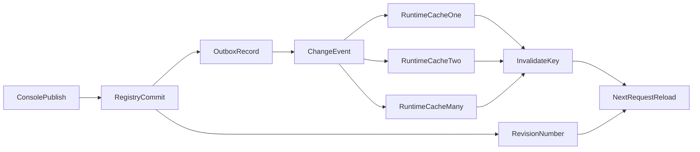

**热加载说明：**

- Publish 的事实完成点是 Registry 中不可变版本与 Outbox 在同一事务中提交成功。
- `ChangeEvent` 只通知 Resource ID、Version/Revision 等轻量信息，不广播整份配置。
- Runtime 收到事件只做 Cache Invalidate；下一次请求再从 Registry 解析最新 Published Version。
- Dev 模式没有 Redis 时通过 SQLite Revision Polling 实现同一语义。
- Event 丢失时 Revision/TTL Check 兜底；安全敏感的撤销操作在真正调用 Tool/MCP 前还需要重新执行 Authorization Check。


Event 丢失时由 TTL/Version Check 保证最终一致性。安全敏感资源需要更严格的 revocation/version check。

#### 3.2.8 Plugin Contract

核心接口建议包含：

```python
class Plugin(Protocol):
    manifest: PluginManifest
    async def setup(self, ctx: PluginContext) -> None: ...
    async def shutdown(self) -> None: ...

class CapabilityProvider(Protocol):
    def capabilities(self) -> list[CapabilityDescriptor]: ...
```

`PluginManifest` 至少定义：

```text
plugin_id
version
type
entrypoint
trust_level
permissions
dependencies
compatibility
```

Runtime 依赖 Capability Contract，不直接依赖具体 Plugin 类。

#### 3.2.9 Hook/Event Contract

```python
class HookRegistration:
    event: str
    priority: int
    timeout_ms: int | None
    fail_policy: Literal["fail_open", "fail_closed", "ignore"]
    scope: Literal["global", "tenant", "agent", "user"]
```

Event Payload 必须类型化，禁止通过无约束 `dict` 长期演进核心协议。

#### 3.2.10 Tool 调用链

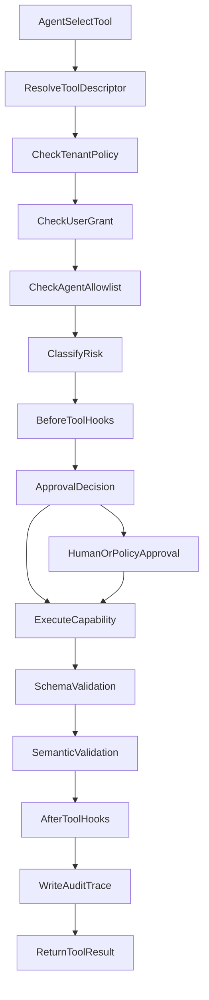

**调用链说明：**

- Tool 是否“存在”与是否“允许调用”是两个阶段；任何 User Grant、Agent Allowlist、Tenant Policy 未通过都必须在执行前拒绝。
- `RiskClassification` 决定是否进入审批和使用哪一级 Semantic Validation。
- `before_tool_call` 可以执行安全、DLP、参数变换等 Hook；安全 Hook 超时通常 `fail_closed`。
- Capability 返回后至少经过 Schema Validation；中高风险写操作按策略增加 Rule/Semantic Validation。
- 每次调用必须记录 `execution_id`、`tool_id`、`capability_id`、`policy_decision_id` 和耗时，Secret 必须脱敏。


#### 3.2.11 Model Provider 插件（FEAT-19 / RULE-17）

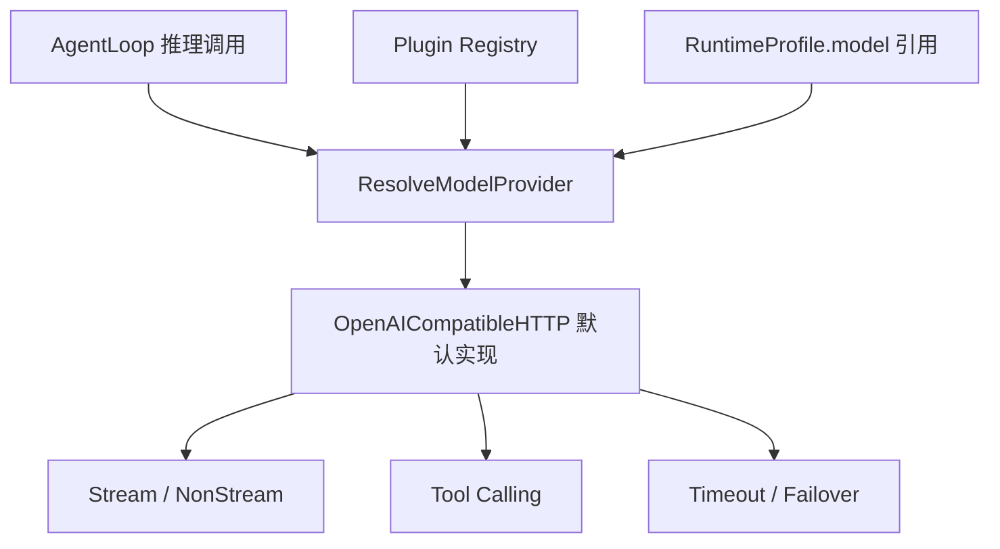

**说明：**

- AgentLoop 一律经 Model Provider 插件完成推理，不直接依赖任何具体模型 SDK（RULE-17）。
- V1 默认实现为 OpenAI-compatible HTTP：支持 stream / non-stream、tool calling、超时与 failover。
- RuntimeProfile 通过 `model` 引用指定 Provider 与参数；新增模型厂商仅新增插件，不修改 AgentLoop。
- Contract 显式声明模型能力差异（tool calling 支持等），V1 先覆盖 text + tool calling，多模态输入为 P2 扩展点。

#### 3.2.12 内置基础工具与 Tool Result Contract（FEAT-20 / RULE-18）

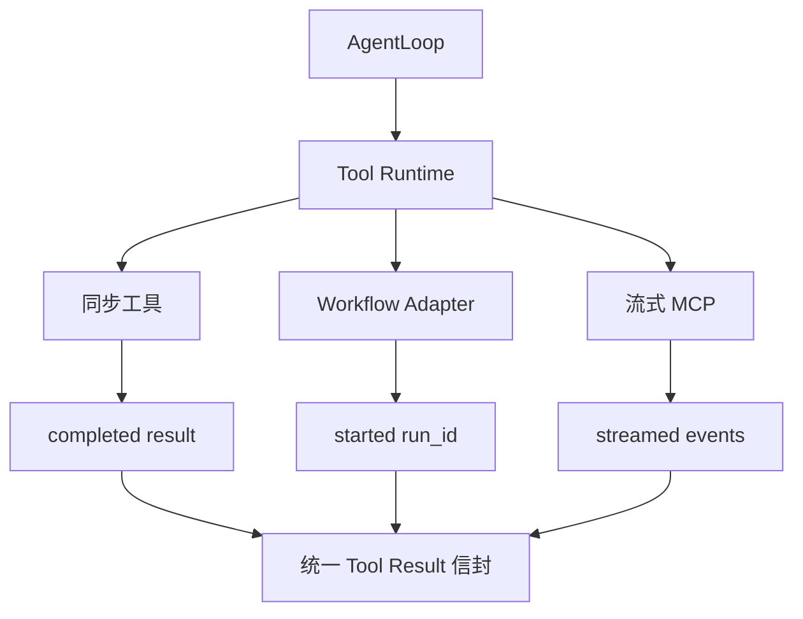

**说明：**

- V1 内置业务无关基础工具：`time`/`calc`/`http.get`（P0，零外部依赖）与 `search_files`/`read_file`/`list_dir`/`write_file`/`run_command`（P1；`run_command`/`code.exec` 必须经 Sandbox Backend，`file.*` 受路径 allowlist 与审批约束）。
- 所有 Tool 调用结果统一为 Tool Result Contract 三形态：`completed(result)` / `started(run_id,status)` / `streamed(events)`（RULE-18）。
- Workflow 走 `started` 异步（返回 `workflow_run_id`）；AgentLoop 不区分执行体类型，统一消费信封。
- 内置工具作为第一方工具注册，走 §3.2.10 统一调用链（权限 / 审批 / Trace）。

#### 3.2.13 Sandbox Backend（FEAT-21 / RULE-20）

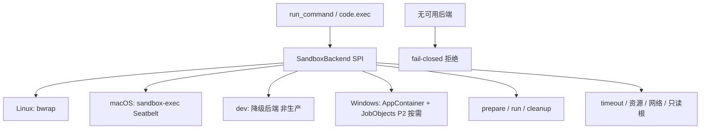

**说明：**

- `run_command`/`code.exec` 与 ADR-010 不可信扩展统一经 SandboxBackend SPI 执行，禁止脱离沙箱直接执行命令（RULE-19）。
- 平台键控后端注册：Linux 走 bwrap（namespace/seccomp 真实隔离，V1 生产）；macOS 走原生 sandbox-exec（Seatbelt profile，真实隔离文件系统与网络；Apple 已将其标 deprecated，后续可迁移 App Sandbox）；dev 降级实现（显式标注非生产、不伪装隔离边界）；Windows 原生后端（AppContainer + Job Objects）标 P2 按需。
- 沙箱默认无网络、只读根文件系统、CPU/内存/超时上限；越权访问直接终止并记录 Trace（RULE-20）。
- fail-closed：当前平台无可用后端时拒绝执行，跨平台只保证"无隔离不执行"。

#### 3.2.14 Memory 多层与上下文压缩（FEAT-22/23 / RULE-21/22）

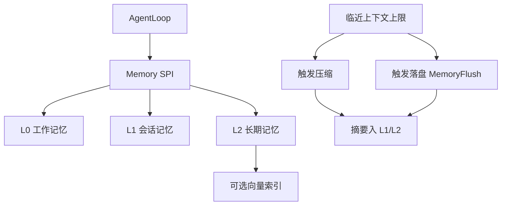

**说明：**

- Memory 默认实现三层：L0 工作记忆（单次执行，RuntimeContext 瞬时）、L1 会话记忆（单会话，SessionMemoryStore）、L2 长期记忆（跨会话·tenant 作用域，外部 Store + 可选向量索引）；复用 FEAT-15 SPI（RULE-21）。
- 临近上下文上限触发**落盘**（MemoryFlush）与**压缩**（FEAT-23）：压缩保留最新 N 轮原文、旧轮次压缩为摘要，摘要落入 L1/L2，原文按 `memory_policy` 保留或弃（RULE-22）。
- 压缩只作用于对话上下文，不得改变 ExecutionSnapshot；向量索引为可选后端、默认不启用（P06 零外部依赖）。

#### 3.2.15 定时/主动任务（FEAT-24 / RULE-23）

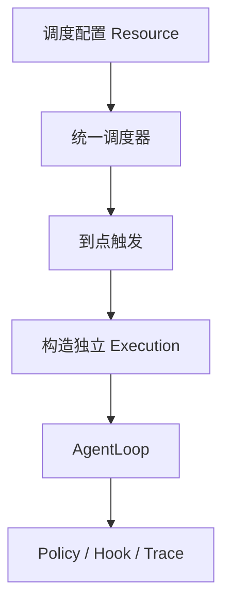

**说明：**

- 统一调度器按时间（Cron/Heartbeat）触发 AgentLoop，每次触发构造**独立 Execution**，Runtime 不保存跨执行持久状态（RULE-23）。
- 调度配置作为 Resource 管理（版本化、可审计），触发与执行受 RuntimePolicy/Approval 约束，避免资源滥用。
- 主动任务与被动请求共用同一 AgentLoop 与调用链，无第二套执行路径。

#### 3.2.16 AgentLoop 规划（FEAT-25 / RULE-24）

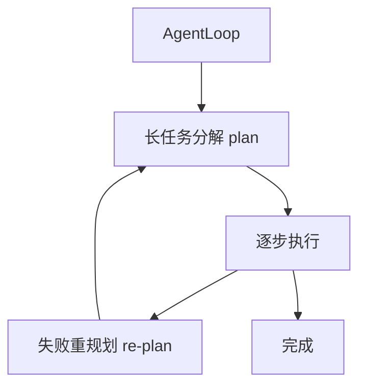

**说明：**

- AgentLoop 对长任务先产出步骤序列（plan），逐步执行；失败触发重规划（re-plan）（RULE-24）。
- 规划状态只存在于当前 Execution，Runtime 不持久化规划事实状态。
- 规划与执行均记录 Trace（plan 变更、步骤结果、重规划原因）。

#### 外部依赖清单

| 外部系统 | 依赖类型 | 协议 | 超时 | 降级策略 |
|---------|---------|------|------|---------|
| LLM Provider | Runtime dependency | HTTP/Provider SDK | 默认 60s，可按模型覆盖 | Model Router/failover；超时后按 agent policy 决定重试/切换 |
| Registry Service | Config dependency | HTTP/gRPC/DB adapter | 2s | L1 Cache + TTL；安全资源 fail-closed |
| Session/Memory Store | State dependency | SPI | 2s | 按 Memory Policy 降级 |
| MCP Server | Capability | MCP | 默认 15s，可按 Tool 覆盖 | 单 MCP Tool 失败不应默认终止整个 Runtime |
| Workflow Engine | Durable workflow | HTTP/gRPC | 5s（仅启动/查询；长流程异步） | 返回依赖错误/可重试状态 |
| A2A Agent | Agent capability | minimal A2A | 默认 30s | timeout/circuit breaker |

---

### 3.3 数据设计 [必填]

Runtime 的“数据设计”重点是 Resource Schema 和 Production Store 参考模型；Core 不要求固定数据库实现。

**参考表: `agent_definition`**

| 字段名 | 类型 | 可空 | 默认值 | 索引 | 说明 |
|--------|------|------|--------|------|------|
| id | UUID/string | N | - | PK(与 version 组合) | Resource ID |
| tenant_id | string | N | - | IDX | system scope 使用约定值 |
| version | string/int | N | - | PK/UK | 不可变版本 |
| status | string | N | draft | IDX | draft/published/deprecated |
| spec_json | JSONB | N | - | | RuntimeProfile |
| created_at | timestamp | N | now | | |
| published_at | timestamp | Y | | | |

**参考表: `resource_binding`**

| 字段名 | 类型 | 可空 | 默认值 | 索引 | 说明 |
|--------|------|------|--------|------|------|
| binding_id | UUID | N | - | PK | |
| tenant_id | string | N | - | IDX | |
| subject_type | string | N | - | IDX | tenant/user/agent/global |
| subject_id | string | N | - | IDX | |
| resource_type | string | N | - | IDX | skill/mcp/plugin |
| resource_id | string | N | - | IDX | |
| resource_version_selector | string | Y | latest-published | | |
| config_json | JSONB | Y | | | 不存 Secret 明文 |
| credential_ref | string | Y | | | SecretRef |
| enabled | bool | N | true | IDX | |
| created_at | timestamp | N | now | | |

**参考表: `execution_snapshot`**

| 字段名 | 类型 | 可空 | 默认值 | 索引 | 说明 |
|--------|------|------|--------|------|------|
| execution_id | UUID/string | N | - | PK | |
| tenant_id | string | N | - | IDX | |
| user_id | string | N | - | IDX | |
| runtime_profile_id | string | N | - | IDX | |
| snapshot_json | JSONB | N | - | | 精确资源版本 |
| trace_id | string | N | - | IDX | |
| created_at | timestamp | N | now | IDX | |

**ER图**

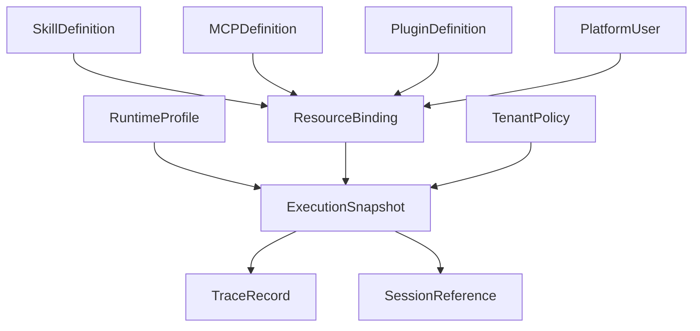

**数据关系说明：**

- Definition 表示公共/版本化定义；Binding 表示用户、租户或 Agent 对定义的配置与授权关系。
- `ExecutionSnapshot` 不复制所有业务数据，只保存足以复现执行的精确 Resource Version、Binding/Policy Version 和关键解析结果。
- `TraceRecord` 必须能反查 Snapshot；Session 只保存引用，真实 Memory/Session 内容仍由外部 Store 管理。


**索引设计**

| 索引名 | 类型 | 字段 | 使用场景 |
|--------|------|------|---------|
| idx_agent_published | composite | tenant_id,id,status,version | 解析最新 Published Agent |
| idx_binding_subject | composite | tenant_id,subject_type,subject_id,resource_type | 解析用户/Agent Binding |
| idx_snapshot_trace | btree | trace_id | Trace → Snapshot |
| idx_snapshot_agent_time | composite | tenant_id,runtime_profile_id,created_at | Eval/问题追溯 |

**容量预估**

| 维度 | 预估值 |
|------|--------|
| RuntimeProfile 设计容量 | 单租户 10,000；平台总量 100,000 |
| Binding 设计容量 | 平台总量 1,000,000 |
| ExecutionSnapshot 设计容量 | 10,000,000/日；热数据保留 7 天，超过后归档/清理策略可配置 |
| Trace 留存 | 热查询 7 天；默认归档 30 天；合规场景由租户策略覆盖 |

---

### 3.4 接口设计 [必填]

本模块同时存在 **HTTP API + CLI + Python SDK** 三种入口。三者最终调用同一 Application Service，不允许形成三套业务逻辑。

#### 3.4.1 HTTP API 接口清单

| 接口ID | 名称 | 方法 | 路径 | 说明 |
|--------|------|------|------|------|
| API-01 | 执行 Agent | POST | `/api/v1/runtime-profiles/{runtime_profile_id}/runs` | 创建一次 Execution |
| API-02 | 查询执行 | GET | `/api/v1/runs/{execution_id}` | 查询状态/摘要 |
| API-03 | 流式执行 | POST | `/api/v1/runtime-profiles/{runtime_profile_id}/runs:stream` | SSE 为 V1 默认；双向实时场景后续再评估 WebSocket |
| API-04 | Runtime 健康检查 | GET | `/health` | 不依赖外部昂贵调用 |
| API-05 | Runtime 就绪检查 | GET | `/ready` | 检查关键依赖 |

#### API-01: 执行 Agent

**请求**

| 参数 | 类型 | 必填 | 说明 |
|------|------|------|------|
| runtime_profile_id | path string | Y | RuntimeProfile ID |
| tenant_id | header/context | Y | 生产模式必须可信来源 |
| user_id | context | Y | 生产模式必须可信来源 |
| input | object/string | Y | 用户输入 |
| session_id | string | N | 多轮会话 |
| metadata | object | N | 受控 metadata |

**请求示例**

```json
{
  "input": "查询我今天需要处理的任务",
  "session_id": "sess_xxx"
}
```

**响应示例**

```json
{
  "code": 0,
  "message": "success",
  "data": {
    "execution_id": "run_xxx",
    "runtime_profile_id": "assistant",
    "runtime_profile_version": "12",
    "output": {},
    "trace_id": "trace_xxx"
  },
  "request_id": "req_xxx"
}
```

**错误码**

| 错误码 | 信息 | 场景 | HTTP状态码 |
|--------|------|------|----------|
| AGENT-40001 | invalid request | 参数/上下文校验失败 | 400 |
| AGENT-40301 | capability denied | Policy Intersection 拒绝 | 403 |
| AGENT-40401 | agent not found | 无 Published RuntimeProfile | 404 |
| AGENT-40901 | resource version conflict | Snapshot 资源版本不可解析 | 409 |
| AGENT-42401 | dependency unavailable | MCP/Workflow/Registry 等关键依赖失败 | 424/503，统一按错误模型规范实现 |
| AGENT-50001 | execution failed | Runtime 非预期错误 | 500 |

**处理逻辑**

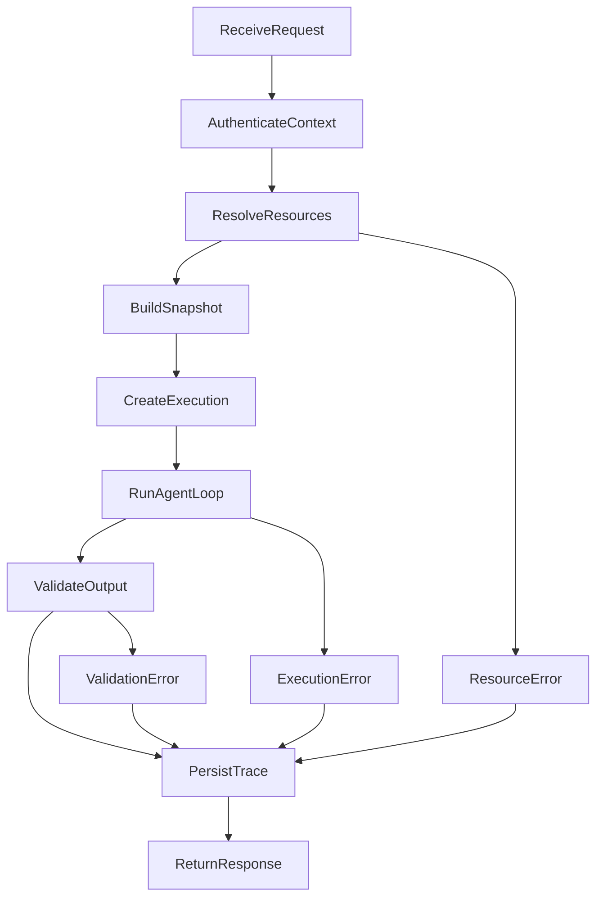

**接口处理说明：**

- 任何失败路径都必须先写入可追踪的错误分类和 Trace，再向调用方返回标准 Error Model。
- API、CLI、SDK 都复用这条 Application Service 链路，因此不能在入口层增加只对某一种入口生效的执行规则。


#### 3.4.2 CLI

| 命令 | 参数 / Flag | 说明 | 退出码 |
|------|------------|------|--------|
| `fluxion run` | `--agent <file|id>` `--input` | 执行一次 Agent | 0 成功 / 非0失败 |
| `fluxion serve` | `--config-provider file|database|remote` | 启动 Runtime API | 0/非0 |
| `fluxion validate` | `<resource-file>` | 校验 Resource Schema | 0/非0 |
| `fluxion plugins list` | `--json` | 查看已加载 Plugin/Capability | 0/非0 |

stdout 默认用户可读；机器处理使用 `--json`；诊断信息进入 stderr；不得在输出中暴露 Secret。

#### 3.4.3 Python SDK

| 函数签名 | 入参 | 返回 | 错误处理 |
|---------|------|------|---------|
| `AgentRuntime.run(runtime_profile_id, input, context) -> RunResult` | agent/input/context | RunResult | FluxionError 子类 |
| `AgentRuntime.stream(...) -> AsyncIterator[RunEvent]` | 同上 | typed events | FluxionError |
| `ResourceResolver.resolve(...) -> ExecutionSnapshot` | tenant/user/agent | snapshot | ResourceError |
| `RegistryStore.get(resource_type,id,selector)` | resource selector | Resource | StoreError |

---

### 3.5 质量实现方案 [必填]

#### 性能设计

| 指标ID | 热点路径 | 目标值 | 实现方案（含被放弃的较慢方案） |
|--------|---------|-------|------------------------------|
| NFR-PERF-01 | 每请求 Resource Resolve | L1 命中 P95 ≤ 5ms | L1 immutable cache + version key；放弃每次全量查 DB |
| NFR-PERF-02 | Binding/Policy Intersection | P95 ≤ 5ms | 预编译/缓存 selector 与 policy；避免重复反序列化 |
| NFR-PERF-03 | Hook Dispatch | 框架调度 P95 ≤ 10ms，不含 Hook 外部 I/O | 预排序 registration；避免运行时扫描全部 Plugin |
| NFR-PERF-04 | MCP Client | 连接池命中获取 P95 ≤ 10ms；新建连接不计入该指标 | 按 tenant/user/server/credential_version 建连接池；Credential 变化失效 |

#### 可靠性设计

| 风险ID | 失效模式 | 影响 | 应对措施 | 验证场景 |
|--------|---------|------|---------|---------|
| RISK-01 | config.changed 消息丢失 | Runtime 暂时使用旧缓存 | TTL + Version Check | B-R01 |
| RISK-02 | Registry 短暂不可用 | 新资源无法解析 | L1 cache + 分级 fail policy | E-R01 |
| RISK-03 | Plugin 阻塞 | 请求长尾/Pod 饥饿 | timeout/isolation | E-R05/E-R06 |
| RISK-04 | 跨租户缓存污染 | 数据泄露 | tenant key 强制进入 cache key | E-R07 |
| RISK-05 | Snapshot 不完整 | 不可复现 | Snapshot schema 必填版本 + trace | S-R03/S-R09 |
| RISK-06 | MCP Credential 已撤销但连接复用 | 越权 | credential_version 进入 pool key + revoke event | E-R08 |

#### 安全性设计

| 指标ID | 验收标准 | 实现方案 |
|--------|---------|---------|
| NFR-SEC-01 | tenant 强隔离 | Context 强制 tenant_id；Store/Cache/Policy 全链路携带 |
| NFR-SEC-02 | Secret 不落 Definition/Trace | CredentialRef + SecretProvider SPI + redaction |
| NFR-SEC-03 | Tool/MCP 最小权限 | User Grant ∩ Agent Allowlist ∩ Tenant Policy |
| NFR-SEC-04 | Plugin 可信边界 | manifest trust_level + isolation policy |


#### DFX 设计要求 [必填]

DFX（Design for X）不是上线前补充项，而是编码阶段必须遵守的设计约束。V1.2 至少覆盖以下维度：

| DFX ID | 维度 | 设计目标 | 强制实现要求 | 验证方式 |
|--------|------|---------|-------------|---------|
| DFX-01 | Design for Availability | 单 Pod/单非关键 Plugin 故障不扩大 | Stateless、HPA、关键依赖超时、非关键 Hook fail-open | E2E 故障注入 |
| DFX-02 | Design for Reliability | 配置和执行可恢复、可重放、可追溯 | Immutable Version、ExecutionSnapshot、幂等 execution/tool request key | E2E + chaos |
| DFX-03 | Design for Scalability | Runtime 可线性横向扩展 | 无 Pod 本地事实状态；Cache tenant-aware；共享状态外置 | 多 Pod 压测 |
| DFX-04 | Design for Performance | 框架开销受预算约束 | Resolver/Hook/Snapshot 指标预算；禁止每请求全量 DB 扫描 | Benchmark + load test |
| DFX-05 | Design for Security | 多租户、Secret、Plugin、Tool 最小权限 | tenant scope、SecretRef、trust level、Policy Intersection | 安全 E2E |
| DFX-06 | Design for Maintainability | Core 不随功能增长持续膨胀 | Microkernel、稳定 Contract、Plugin capability registration | 架构测试/依赖检查 |
| DFX-07 | Design for Testability | 关键边界可自动化验证 | Store Contract Test、typed event、Provider SPI；CI 同跑 SQLite/PG | CI |
| DFX-08 | Design for Observability | 所有执行都能定位到版本与依赖 | execution_id/trace_id/snapshot/tool/hook spans | Trace E2E |
| DFX-09 | Design for Deployability | Runtime 发布与 Resource 发布解耦 | Runtime rolling update；Resource hot publish | 发布演练 |
| DFX-10 | Design for Compatibility | Plugin/Resource Schema 可演进 | contract version、compatibility manifest、deprecated lifecycle | compatibility suite |
| DFX-11 | Design for Recoverability | 关键依赖恢复后系统自动恢复 | retry/backoff/circuit breaker；无人工 Pod 状态修复 | 故障恢复测试 |
| DFX-12 | Design for Operability | 运维可通过标准指标判断问题 | SLI/SLO、结构化日志、明确 error taxonomy | 运维演练 |

**编码阶段硬约束：**

1. 新增核心模块必须明确对应 Pxx、FEAT、DFX。
2. 新增外部依赖必须定义 timeout、retry、circuit-breaker/fail policy。
3. 新增 Cache 必须定义 key scope、TTL、invalidation 和 stale 行为。
4. 新增持久数据必须定义 owner、retention、索引和清理策略。
5. 新增 Plugin/Hook 必须定义 trust、timeout、fail policy、observability。
6. 新增 API/Contract 必须定义 versioning、error model、idempotency（如适用）。
7. 性能关键路径不得在没有 benchmark 的情况下引入全量扫描、同步阻塞 I/O 或 N+1 查询。
8. Runtime Core 不允许反向依赖具体 Provider/Plugin 实现。
9. 所有高风险 Tool/MCP 写操作必须可审计，并能关联 `execution_id` 和 `policy_decision_id`。
10. 合并前 CI 必须至少执行：unit、integration、SQLite/PG Store Contract、核心 E2E、静态检查与依赖边界检查。

#### 可观测性设计

| 场景 | 实现方案 |
|------|---------|
| 监控指标 | OpenTelemetry Metrics / Prometheus exporter（实现可插拔） |
| 日志 | 结构化 JSON，tenant_id/runtime_profile_id/execution_id/trace_id，敏感字段脱敏 |
| 链路追踪 | OpenTelemetry，LLM/Tool/MCP/Workflow/Hook span |
| 配置追溯 | Trace 关联 ExecutionSnapshot |
| Eval | Trace 可导出为 Versioned Eval 输入 |

---

## 4. 部署与运维

### 4.1 部署架构

| 环境 | 配置 | 实例数 | 用途 |
|------|------|--------|------|
| local | 2C4G 以内即可完成核心开发与测试 | 1 套 dev bundle | Agent Runtime + Console API/Web + Chat Web + SQLite |
| dev | 2C4G/实例 | 1-2 | 集成测试 |
| prod shared runtime | 2C4G 起步/实例 | HPA 2-50（按压测调整） | 多 Agent 共享 Stateless Pool |
| prod dedicated | 按 runtime_policy 与工作负载单独定义 | 按需 | GPU/高隔离/Sandbox |

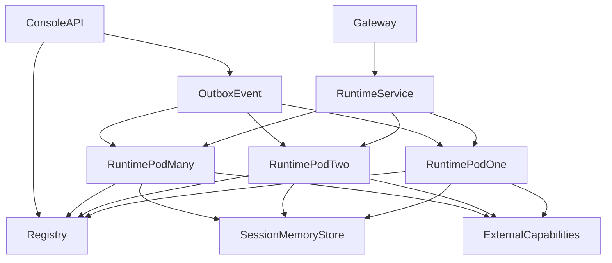

**部署说明：**

- Console API 和 Runtime Pool 可以独立扩容，二者不要求同 Pod。
- Runtime Pod 之间不共享本地事实状态；任意请求可落到任意 Pod。
- Registry、Session/Memory Store 和外部 Capability 是共享依赖。
- Console 只负责写入 Registry 和发布变更事件，不直接修改 Runtime 内存对象。


### 4.2 发布与回滚

**Runtime 程序发布**

| 阶段 | 范围 | 持续 | 进入条件 | 回滚条件 |
|------|------|------|---------|---------|
| dev/canary | 10% Runtime 流量 | ≥30min | Contract/E2E/DFX 回归全部通过，5min error rate <0.5% | 5min error rate ≥1% 或框架 P95 >50ms 持续10min |
| 全量 | 100% | - | Canary 通过 | 生产错误明显上升 |

**Resource 发布**

不通过 Runtime 镜像发布。采用 `Draft → Validate → Publish Version → Event → Cache Invalidate`。回滚通过重新激活/发布上一稳定 Resource Version 完成。

### 4.3 监控告警

| 指标 | 阈值 | 级别 | 处理SLA |
|------|------|------|---------|
| Runtime error rate | 5min 窗口 >1% | P1 | 10min 内响应 |
| Resource resolve failure | 5min 窗口 >0.5% | P1 | 10min 内响应 |
| Registry dependency failure | 连续 1min 不可用 | P1 | 10min 内响应 |
| Hook timeout/fail_closed count | 5min 内 ≥10 次或占比 >1% | P1 | 10min 内响应 |
| MCP/Tool error rate | 单能力 5min 窗口 >5% | P2 | 30min 内响应 |
| P95/P99 framework overhead | P95 >50ms 或 P99 >100ms 持续 10min | P2 | 30min 内响应 |


---

## 5. 风险与依赖

### 5.1 项目依赖

| 依赖模块/团队 | 依赖内容 | 状态 | 风险等级 |
|-------------|---------|------|---------|
| Console / Control Plane | 同仓 Resource Schema、Binding、发布事件、Web Channel Binding | 设计中 | 高 |
| Workflow Platform | Workflow Tool Contract（Adapter 接入协议，FEAT-13）在开源 V1 定义并实现；Engine/durable state 由业务接入层提供 | Adapter 已定义（S-R08 Stub 验证）；Engine 待业务接入 | 低 |
| Capability Center | Capability Schema/Error Model | Runtime 保留 CapabilityProvider 接口；Center/Registry 归业务接入层 | 低 |
| Secret Provider | CredentialRef/Secret 获取 | V1 采用 DB 加密 SecretStore：AES-256-GCM，Master Key 由环境变量/K8s Secret 注入；后续可实现 Vault/KMS Plugin | 高 |
| Identity/Tenant | tenant_id/user_id 可信上下文 | 待对接 | 高 |
| Observability | Trace/Metric backend | OpenTelemetry + Prometheus Metrics；Trace V1 存 PostgreSQL 独立表/分区，生产规模扩大后可替换 ClickHouse/Tempo Plugin | 中 |

### 5.2 风险识别

| 风险ID | 类型 | 描述 | 概率 | 影响 | 应对措施 | 验证场景 |
|--------|------|------|------|------|---------|---------|
| RISK-01 | 架构 | Microkernel 初始设计过度抽象 | 中 | 中 | Contract 只覆盖当前 Pxx；避免抽象未知需求 | ADR/代码评审 |
| RISK-02 | 性能 | 每请求资源解析增加延迟 | 中 | 高 | Snapshot + L1 cache + benchmark | S-R02/B-R03 |
| RISK-03 | 安全 | Plugin/MCP 越权 | 中 | 高 | trust boundary + policy intersection | E-R03/E-R05/E-R07 |
| RISK-04 | 一致性 | Event 丢失造成旧配置 | 中 | 高 | TTL/version check/revocation | B-R01 |
| RISK-05 | 兼容性 | Plugin Contract 早期频繁破坏 | 高 | 中 | versioned capability contract + compatibility manifest | integration |
| RISK-06 | 兼容性 | 新 Runtime 的行为模型与旧项目使用习惯存在差异 | 中 | 中 | 通过 Design Drivers 问题清单、E2E 与用户验收验证新行为，不承担旧数据兼容 | E2E |

---

## 6. 需求追溯矩阵

| 用户故事 | 功能ID | 接口ID | 测试用例ID | 测试层级 | 状态 |
|---------|--------|--------|-----------|---------|------|
| US-01 | FEAT-01/05 | CLI/SDK | S-R01/S-R07 | E2E/integration | 待实现 |
| US-02 | FEAT-04/06 | API-01 | S-R02/S-R03/B-R01 | E2E | 待实现 |
| US-03 | FEAT-02/15/17 | API-01 | S-R05/B-R03 | E2E | 待实现 |
| US-04 | FEAT-03/10/11 | API-01 | S-R04/E-R03/E-R08 | E2E | 待实现 |
| US-05 | FEAT-07/08 | SDK | E-R05 | integration | 待实现 |
| US-06 | FEAT-09/12 | API-01 | S-R06/E-R06 | integration/E2E | 待实现 |
| US-07 | FEAT-04/16/18 | API-02 | S-R09/E-R02 | E2E | 待实现 |
| US-08 | FEAT-12/13/14 | API-01 | S-R08 | E2E | 待实现 |
| DFX 基线 | FEAT-01~25 | API/CLI/SDK | S-R01~S-R20/E-R01~E-R09/B-R01~B-R07 | unit/integration/E2E | 待实现 |

---

## Spec Compliance Matrix

| Spec/Rule | enforcement | 设计影响 | 设计落点 | 验证场景 | 状态/N/A 理由 |
|-----------|-------------|---------|---------|---------|----------------|
| DesignDrivers#P01 | required | 配置与进程解耦 | §3.2.6 / FEAT-06 | S-R02/B-R01 | applied |
| DesignDrivers#P02 | required | Runtime 无状态 | §3.2 / RULE-06 | S-R05 | applied |
| DesignDrivers#P03 | required | Skill/MCP User Binding | §2.3 / FEAT-03/10/11 | S-R04 | applied |
| DesignDrivers#P04 | required | Store SPI | §3.1/3.2 | S-R07 | applied |
| DesignDrivers#P05 | required | RuntimeProfile 与 Pod 解耦 | §4.1 | S-R05/B-R03 | applied |
| DesignDrivers#P06 | required | Console-first dev 配置（Kernel SDK/CLI 可独立调用） | FEAT-01 | S-R01 | applied |
| DesignDrivers#P07 | required | Snapshot | FEAT-04 | S-R03 | applied |
| DesignDrivers#P08 | required | Microkernel/Plugin | §3.2.3/3.2.6 | E-R05 | applied |
| DesignDrivers#P09 | required | Hook | §3.2.7 | S-R06/E-R06 | applied |
| DesignDrivers#P10 | required | Plugin trust | §3.2.7/§3.5 | E-R05 | applied |
| DesignDrivers#P11 | required | Workflow durable boundary（Engine 归业务接入层） | FEAT-13 | S-R08 | applied |
| DesignDrivers#P12 | required | Capability contract | §3.2.8 | S-R08 | applied |
| DesignDrivers#P14 | required | Semantic Validation | Tool chain | E2E：语义错误结果必须被 L2/L3 策略拦截 | applied |
| DesignDrivers#P16 | required | Tool/MCP policy | RULE-04 | S-R04/E-R03 | applied |
| DesignDrivers#P17 | required | User Context 外置 | Session/Memory SPI | S-R05 | applied |
| DesignDrivers#P18 | required | Continuous Eval | §3.5 | S-R09 | applied |
| DesignDrivers#P19 | required | Latency budget | NFR-PERF | 按 NFR-PERF-01~04 执行 | applied |
| DesignDrivers#P20 | advisory V1 | Minimal A2A | FEAT-14 | integration | applied |
| DesignDrivers#P22 | required | Problem-driven | 全文 | 评审 | applied |

---

## 附录：术语表

| 术语 | 定义 |
|------|------|
| RuntimeProfile | 运行态配置 的版本化资源定义，不是 Pod/Process |
| Runtime | 无状态 Agent 执行器 |
| ExecutionSnapshot | 单次 Execution 固定的资源版本集合 |
| RegistryStore | Resource Source of Truth 的抽象接口 |
| Binding | User/Tenant/Agent 与 Skill/MCP/Plugin 等 Definition 的配置/授权关系 |
| Effective Capability | User Grant ∩ Agent Allowlist ∩ Tenant Policy 后的最终能力集合 |
| Plugin | Framework Extension |
| Hook | Runtime Lifecycle Interception Point |
| Skill | Agent Knowledge / Procedure |
| MCP | Agent Callable Capability Protocol |
| Capability | 业务事实能力 |
| Workflow | Durable Deterministic Process |
| ADR | Architecture Decision Record |
| NFR | Non-Functional Requirement |

---

*文档结束*
